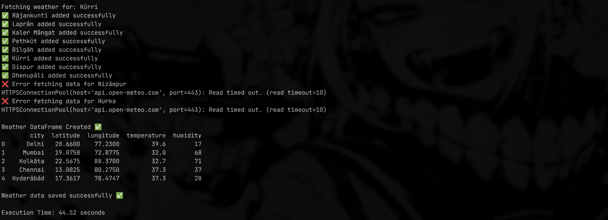

# 🌧️ MonsoonBharat

MonsoonBharat is a climate visualization and weather data engineering project focused entirely on India.

The goal is not just to fetch weather data, but to build a scalable system that can:

* Collect live weather data from hundreds of Indian cities
* Process and structure large climate datasets
* Generate heatmaps and isothermal temperature maps
* Visualize rainfall, humidity, and seasonal trends
* Build toward future ML-based forecasting systems

---

## 🚀 Current Features

✅ Real-time weather fetching using Open-Meteo API
✅ Multi-city climate data pipeline (385+ Indian cities)
✅ ThreadPoolExecutor-based concurrent API system
✅ CSV dataset generation using Pandas
✅ Temperature + humidity analysis
✅ Structured modular Python workflow
✅ Fault-tolerant API handling

---

## 🧠 Tech Stack

* Python
* Pandas
* Requests
* Concurrent Futures
* Open-Meteo API
* Plotly (upcoming)
* SciPy Interpolation (upcoming)

---

## 🌡️ Upcoming Features

* Interpolation Grid System
* Isothermal contour maps
* Rainfall visualization
* Streamlit dashboard
* Historical climate analysis
* ML-based weather forecasting

---

## 📊 Project Vision

Most weather dashboards show isolated numbers.

MonsoonBharat aims to visualize climate as a continuous geographic system across India using real spatial interpolation and climate mapping techniques.

This project is also being built publicly as a learning journey in:

* data engineering
* climate visualization
* concurrency systems
* scalable backend architecture
