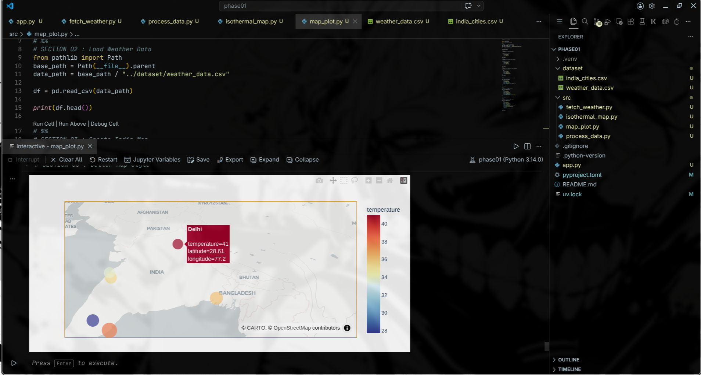
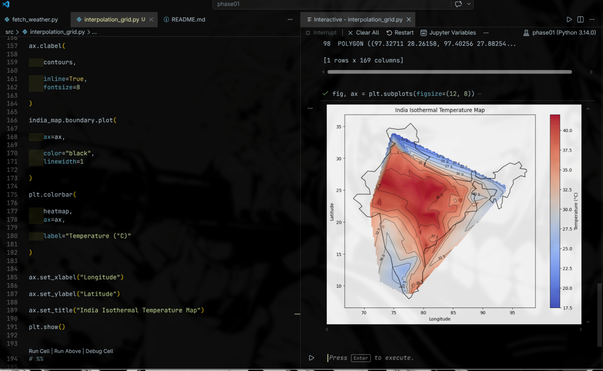
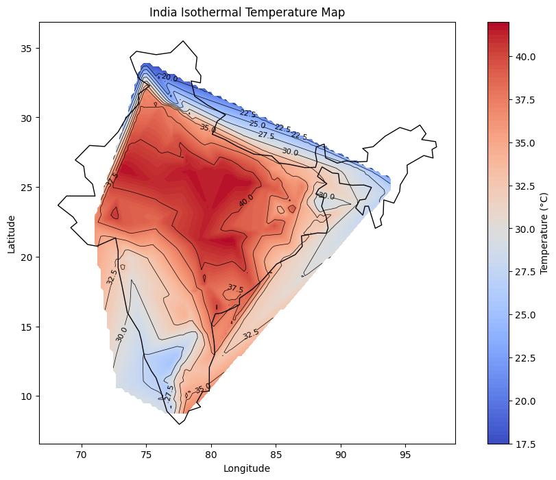

# 🌧️ MonsoonBharat

 PHASE 04D — Interpolation Grid System

MonsoonBharat is a climate visualization and weather data engineering project focused entirely on India.

The goal is not just to fetch weather data, but to build a scalable system that can:

* Collect live weather data from hundreds of Indian cities
* Process and structure large climate datasets
* Generate heatmaps and isothermal temperature maps
* Visualize rainfall, humidity, and seasonal trends
* Build toward future ML-based forecasting systems

---

## 🚀 Current Features

✅ Real-time weather fetching using Open-Meteo API
✅ Multi-city climate data pipeline (385+ Indian cities)
✅ ThreadPoolExecutor-based concurrent API system
✅ CSV dataset generation using Pandas
✅ Temperature + humidity analysis
✅ Structured modular Python workflow
✅ Fault-tolerant API handling

---
🎯 Your Current Dataset Cities:385
🐢 Sequential Version

Suppose: each API request ≈ 1 second average
plus your sleep(1)

Total: 385×1≈385 seconds ≈ 6.4 minutes 😭

🚀 Threaded Version

Suppose: max_workers=5
Means: 5 requests at same time
🧠 Rough Estimation
Total batches: 385/5 ≈ 77 rounds

If each round ≈ 1 second:
Total: 77 seconds ≈ 1.2 minutes 👀🔥

🚀 What About 10 Threads?

385/10 =38.5 ≈ 40 seconds maybe.

## 🧠 Tech Stack

* Python
* Pandas
* Requests
* Concurrent Futures
* Open-Meteo API
* Plotly (upcoming)
* SciPy Interpolation (upcoming)

---

## 🌡️ Upcoming Features

* Interpolation Grid System
* Isothermal contour maps
* Rainfall visualization
* Streamlit dashboard
* Historical climate analysis
* ML-based weather forecasting

---

## 📊 Project Vision

Most weather dashboards show isolated numbers.

MonsoonBharat aims to visualize climate as a continuous geographic system across India using real spatial interpolation and climate mapping techniques.

This project is also being built publicly as a learning journey in:

* data engineering
* climate visualization
* concurrency systems
* scalable backend architecture
