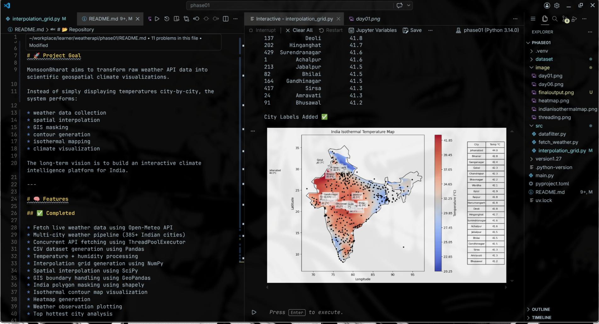
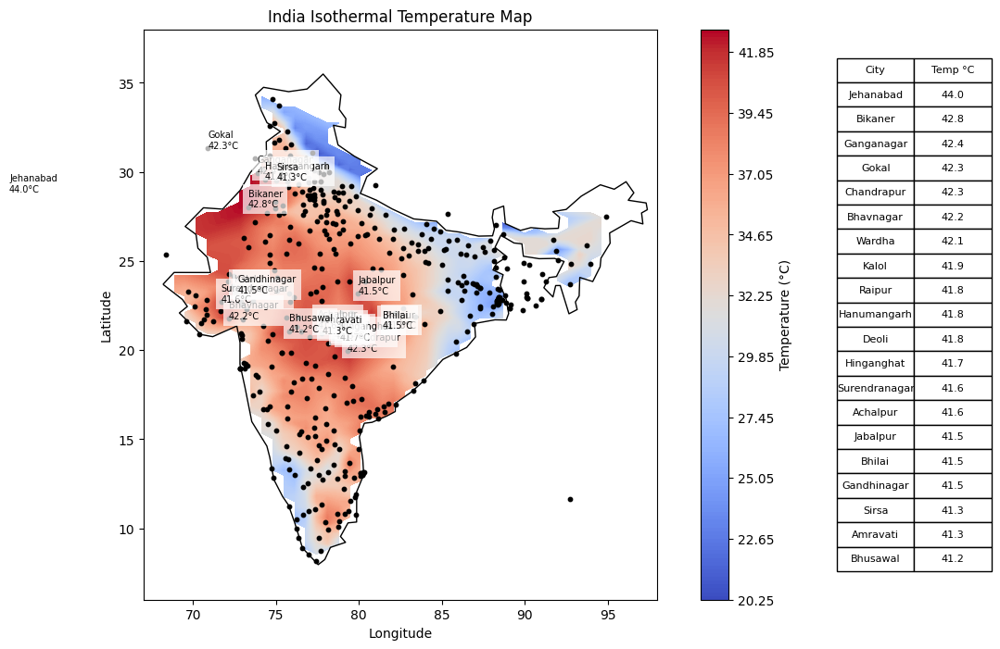
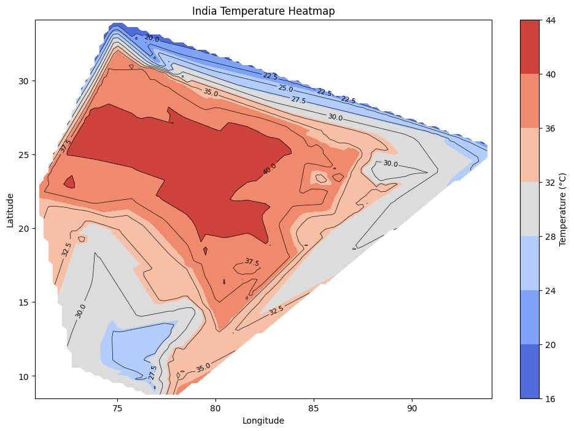

# 🌧️ MonsoonBharat

India-focused climate visualization and GIS weather analysis system built with Python.

---

# 🚀 Project Goal

MonsoonBharat aims to transform raw weather API data into scientific geospatial climate visualizations.

Instead of simply displaying temperatures city-by-city, the system performs:

* weather data collection
* spatial interpolation
* GIS masking
* contour generation
* isothermal mapping
* climate visualization

The long-term vision is to build an interactive climate intelligence platform for India.

---

# 🧠 Features

## ✅ Completed

* Fetch live weather data using Open-Meteo API
* Multi-city weather pipeline (385+ Indian cities)
* Concurrent API fetching using ThreadPoolExecutor
* CSV dataset generation using Pandas
* Temperature + humidity processing
* Interpolation grid generation using NumPy
* Spatial interpolation using SciPy
* GIS boundary handling using GeoPandas
* India polygon masking using shapely
* Isothermal contour map visualization
* Heatmap generation
* Weather observation plotting
* Top hottest city analysis

---

# 🛰️ Technologies Used

| Technology         | Purpose                  |
| ------------------ | ------------------------ |
| Python             | Core programming         |
| Pandas             | Data processing          |
| NumPy              | Numerical arrays         |
| SciPy              | Interpolation            |
| GeoPandas          | GIS processing           |
| Matplotlib         | Scientific visualization |
| Shapely            | Spatial geometry         |
| Open-Meteo API     | Weather data             |
| ThreadPoolExecutor | Concurrent API fetching  |

---

# 🌍 GIS Concepts Learned

This project explores:

* coordinate systems
* latitude / longitude mapping
* interpolation theory
* spatial grids
* GIS polygons
* masking
* contour visualization
* geospatial analysis

---

# 📊 Current Visualization

The system currently generates:

✅ India isothermal temperature maps
✅ Heatmaps
✅ Contour lines
✅ GIS masked spatial maps
✅ Observation city overlays

---

# 🔥 Current Challenges

* coastline interpolation accuracy
* northeast spatial coverage
* label overlap optimization
* better GIS datasets
* historical weather integration

---

# 🚀 Future Roadmap

* [ ] Humidity interpolation maps
* [ ] Rainfall visualization
* [ ] Historical climate analysis
* [ ] Interactive Streamlit dashboard
* [ ] Time-series climate animation
* [ ] Wind vector visualization
* [ ] ML-based forecasting
* [ ] Elevation-aware interpolation
* [ ] Satellite data integration

---

# ⚡ Performance Upgrade

Sequential API requests:
≈ 6+ minutes

Concurrent threaded pipeline:
≈ 40–60 seconds

Implemented using:
`ThreadPoolExecutor(max_workers=10)`

---

# 📸 Example Outputs

* GIS masked India heatmaps
* Isothermal contour maps
* Temperature leaderboards

---

# 🤝 Build In Public

This project is being developed publicly while learning GIS systems, scientific visualization, and climate data engineering from scratch.

ChatGPT is also used heavily for:

* debugging
* documentation understanding
* repetitive work reduction
* GIS concept explanations

---

# 📂 Repository

TECHNOCRAFT27 / MonsoonBharat
